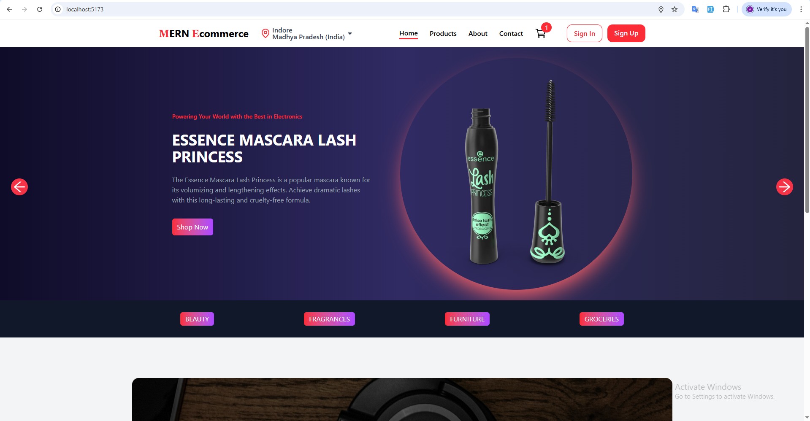

# MERN Ecommerce 🛒

A full-featured **MERN stack ecommerce application** built with **React (Vite)** on the frontend, **Node.js / Express** for APIs, and **MongoDB** for the database.  
This app supports authentication, product filtering, cart, checkout, and geolocation-based delivery info.

---

## ✨ Features

- 🔐 User authentication (Sign In / Sign Up / Profile / Logout)  
- 📦 Product listing with pagination  
- 🔎 Product filters (price, category, etc.)  
- 🛒 Shopping cart with local storage persistence  
- 💳 Checkout flow with delivery & handling charges  
- 📍 Detect location using [Nominatim OpenStreetMap](https://nominatim.openstreetmap.org/)  
- 📱 Responsive design (mobile-friendly navigation)  

---

## 🖼️ Preview

### 🏠 Home Page


---

## 🛠️ Tech Stack

- **Frontend:** React, Vite, TailwindCSS  
- **Backend:** Node.js, Express  
- **Database:** MongoDB  
- **API:** Fake Store API / Custom API  
- **Icons:** React Icons, Lucide React  

---

## ⚙️ Setup & Installation

### 1. Clone the repo
```bash
git clone https://github.com/agangrade5/MERN-Ecommerce.git
cd mern-ecommerce
